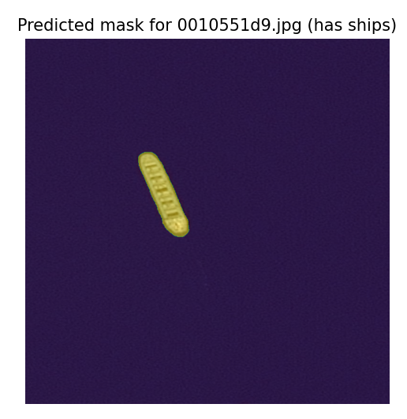
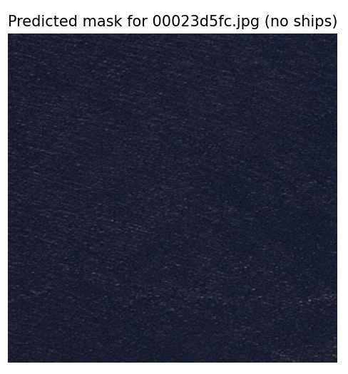

# Test Task (Borys Melnychuk)

My solution could be explained like that: 

I used pretrained PyTorch Unet model with encoder of ResNet34 which I later finetuned using Airbus Ship Dataset.
For train images I used Random Crop of 256 size. For validation images I used Center Crop of 512 size

Structure of the project:

- `loaders.py`
- `losses.py`
- `submission.csv`
- `main.py`
- `metrics.py`
- `requirements.txt`
- `ShipDataset.py`
- `utils.py`
- `test-task.ipynb`
- `model.pt`
- `model_prescripted.pt`
- `model_scripted_cuda.py`
- `kaggle/`
- `├───── input/`
- `├───────────output-images/`
- `├────────────────────────losses.png`
- `├────────────────────────test masks.png`
- `├────────────────────────validation masks.png`
- `├───────────test_v2/`
- `├──────────────────.....jpg`
- `├───────────train_v2/`
- `├──────────────────.....jpg`
- `├───────────sample_submission_v2.csv`
- `├───────────train_ship_segmentations_v2.csv`

`test-task.ipynb` contains EDA, Model Development, Training and submission file. `main.py` trains the model. `test.py` created for testing the model on an image

**🏃 Run:**

Clone the project

```
git clone https://github.com/meln1337/winstars-test-task
```

`main.py` was created for training the model

> [!CAUTION]
> To be able to train the model locally you need to download the whole dataset (the repo have only few of them)

```
python main.py -lr=LEARNING_RATE 
               -n_epochs=EPOCHS_NUMBER 
               -device=DEVICE 
               -root_dir=ROOT_DIRECTORY 
               -train_dir=TRAIN_DIRECTORY 
               -test_dir=TEST_DIRECTORY
               -criterion=CRITERION
```

`test.py` was created for testing the model on a single image

```
python test.py -img_path=IMAGE_PATH
```

The example of `test.py` outputs:



To recreate:

```
python test.py -img_path=./kaggle/input/airbus-ship-detection/test_v2/0010551d9.jpg
```



To recreate:

```
python test.py -img_path=./kaggle/input/airbus-ship-detection/test_v2/00023d5fc.jpg
```


**🚩 Results:**
I trained a model based on UNet architecture with encoder of Resnet34 and got this results:

Output masks on validation images:


Losses


Output masks on test images


- Dice: 0.67961
- Jaccard: 0.62513
- Kaggle public score: 0.67999
- Kaggle private score: 0.81563